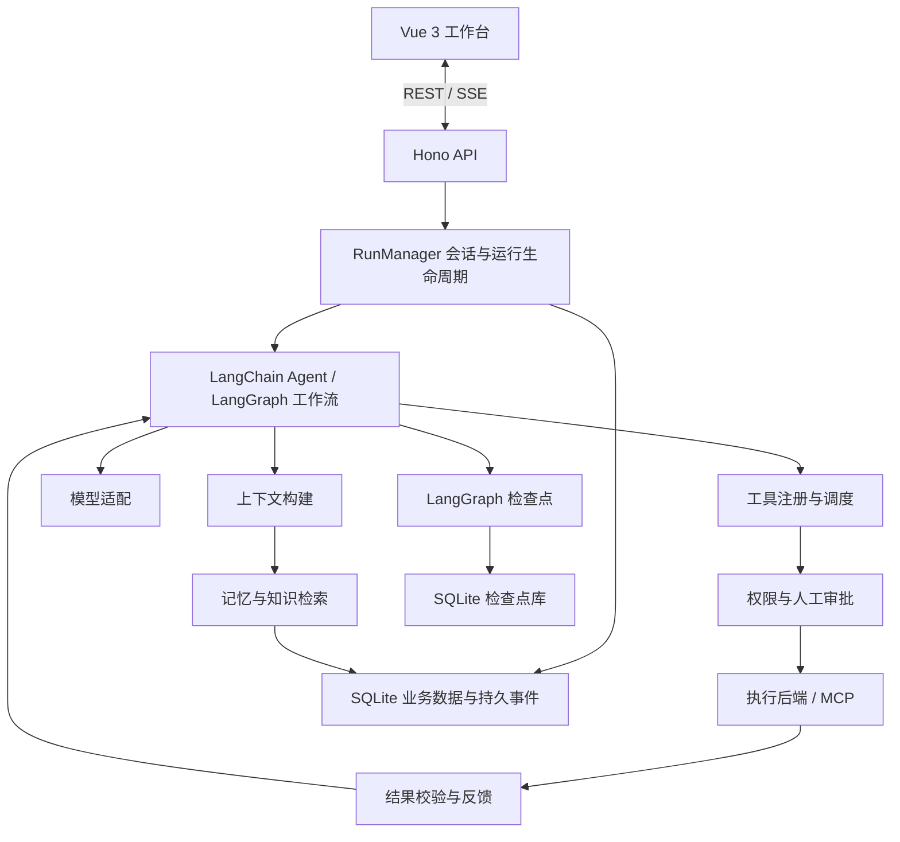

# Flux Agent 技术方案

调研日期：2026-09-23。状态：设计建议，尚未安装依赖或实现功能。

## 1. 产品定位与选型结论

构建一个在用户电脑运行、通过浏览器使用的本地 Agent 工作台。后端访问被授权的本地工作区，负责模型调用、工具执行、任务编排和数据持久化；浏览器负责交互和展示。第一阶段按单用户、多工作区、多会话设计。

“本地”指运行环境与应用数据在本机；模型可以调用远程 API，也可以连接本地模型。完全离线需要额外解决模型推理、Embedding 和联网工具的替代方案。

推荐主栈：

**TypeScript + Node.js 24 LTS + pnpm Workspace + Hono + Vue 3/Vite + Drizzle ORM/better-sqlite3/SQLite + LangChain/LangGraph。**

按 TypeScript 生态本身选择组件，不以其他语言的习惯作为取舍依据。“主流”综合考虑公开使用信号、官方支持、维护情况和适用场景；没有一个权威榜单能认定每种组件的唯一第一名。

架构采用模块化单体。能力之间保留明确契约，部署时由一个本地服务承载，避免首期承担分布式系统的运维成本。

## 2. 选型依据与版本口径

### 2.1 npm 官方使用信号

通过 npm 官方 API 查询 2026-09-15 至 2026-09-21 的下载量：

| 类别 | 包 | 七天下载量 |
| --- | --- | ---: |
| ORM | drizzle-orm | 16,349,086 |
| ORM | @prisma/client | 11,810,728 |
| ORM | typeorm | 3,557,322 |
| ORM | sequelize | 2,007,420 |
| HTTP | express | 101,489,586 |
| HTTP | hono | 46,132,378 |
| HTTP | @nestjs/core | 10,324,932 |
| HTTP | fastify | 9,612,689 |

这只是这些包在这一时间窗口的下载统计，包含 CI、重复安装和间接依赖，不能等同于独立项目数、开发者人数或 SQLite 用户份额。它能支持“Drizzle 和 Hono 已被广泛使用”，不能支持“所有新项目都应该使用它们”。

数据来源：[Drizzle](https://api.npmjs.org/downloads/point/2026-09-15:2026-09-21/drizzle-orm)、[Prisma Client](https://api.npmjs.org/downloads/point/2026-09-15:2026-09-21/%40prisma%2Fclient)、[TypeORM](https://api.npmjs.org/downloads/point/2026-09-15:2026-09-21/typeorm)、[Sequelize](https://api.npmjs.org/downloads/point/2026-09-15:2026-09-21/sequelize)、[Express](https://api.npmjs.org/downloads/point/2026-09-15:2026-09-21/express)、[Hono](https://api.npmjs.org/downloads/point/2026-09-15:2026-09-21/hono)、[NestJS](https://api.npmjs.org/downloads/point/2026-09-15:2026-09-21/%40nestjs%2Fcore)、[Fastify](https://api.npmjs.org/downloads/point/2026-09-15:2026-09-21/fastify)。

### 2.2 当前稳定发布快照

本次读取 npm registry 的 `latest` 标签得到：

| 包 | 本次查询版本 |
| --- | --- |
| hono | 4.13.8 |
| drizzle-orm | 0.45.3 |
| drizzle-kit | 0.31.11 |
| @prisma/client，备选 | 7.10.0 |
| @langchain/langgraph-checkpoint-sqlite | 1.0.4 |
| @langchain/mcp-adapters | 1.1.4 |

这些是调研快照，不是已经验证的依赖组合。初始化时还需联合检查 LangChain、LangGraph、checkpoint、MCP adapter、Zod 的 peer dependencies，并提交 lockfile。尤其是当前 Drizzle 文档示例已出现 `@rc`，实施时应依据所选稳定版的 API，不能照抄预发布安装命令。[Drizzle SQLite 文档](https://orm.drizzle.team/docs/sqlite/get-started-sqlite)

稳定标签来源：[Hono registry](https://registry.npmjs.org/hono/latest)、[Drizzle ORM registry](https://registry.npmjs.org/drizzle-orm/latest)、[Drizzle Kit registry](https://registry.npmjs.org/drizzle-kit/latest)、[Prisma registry](https://registry.npmjs.org/%40prisma%2Fclient/latest)、[SQLite saver registry](https://registry.npmjs.org/%40langchain%2Flanggraph-checkpoint-sqlite/latest)、[MCP adapter registry](https://registry.npmjs.org/%40langchain%2Fmcp-adapters/latest)。这些 URL 的 latest 值以后会变化。

Node.js 采用 24 LTS 的最新安全补丁；本次官方页面将 26 标为 Current、24 标为 LTS。[Node.js 发布表](https://nodejs.org/en/about/previous-releases)

## 3. 组件选型表

### 3.1 工程与服务端

| 需求 | 首选组件 | 在本项目中的用途 |
| --- | --- | --- |
| 语言 | TypeScript，strict 模式 | 类型检查、泛型、联合类型、前后端共享契约 |
| 运行时 | Node.js 24 LTS | HTTP、文件系统、进程、网络和 Agent 后台任务 |
| 包管理与仓库 | pnpm Workspace | 管理 web、server、agent-runtime、contracts 四个包 |
| 本地开发执行 | tsx | 开发期运行/监听后端 TypeScript；类型检查另外执行 |
| 生产构建 | 后端 tsc；前端 Vite | 后端生成 ESM JavaScript，前端构建静态资源 |
| HTTP 框架 | Hono + @hono/node-server | REST API、中间件、鉴权、SSE 和静态资源 |
| 数据校验 | Zod | HTTP、工具参数、插件配置、模型结构化结果的运行时校验 |
| API 文档 | @hono/zod-openapi | 从接口 schema 生成 OpenAPI 文档 |
| 业务数据 ORM | Drizzle ORM | 以 TypeScript 定义表结构和类型安全查询 |
| 迁移 | Drizzle Kit | 生成 SQL migration，启动前顺序应用、记录版本 |
| SQLite 驱动 | better-sqlite3 | 本地数据库访问、短事务、备份接口 |
| 普通 HTTP 请求 | 原生 fetch + AbortController | 取消、超时和流读取；按具体需求增加薄封装 |
| 结构化日志 | Pino | requestId、threadId、runId、toolCallId 与脱敏日志 |
| 代码检查/格式化 | ESLint + typescript-eslint + Prettier | Vue/TS 规则、导入边界、格式统一 |
| 自动化验证 | Vitest + Playwright | 核心逻辑/SQLite 集成测试、浏览器端到端测试 |

Hono 使用 Web 标准接口，官方提供 Node adapter 和 SSE helper；业务运行循环应由 Agent runtime 管理，不放在 HTTP handler 生命周期里。[Hono](https://hono.dev/docs)、[Node adapter](https://hono.dev/docs/getting-started/nodejs)、[Streaming](https://hono.dev/docs/helpers/streaming)、[Zod OpenAPI](https://hono.dev/examples/zod-openapi)

工程组件依据：[TypeScript strict](https://www.typescriptlang.org/tsconfig/strict.html)、[pnpm Workspace](https://pnpm.io/workspaces)、[tsx](https://github.com/privatenumber/tsx)、[Zod](https://zod.dev/)、[ESLint](https://eslint.org/docs/latest/use/getting-started)、[Prettier](https://prettier.io/docs/)、[Pino](https://github.com/pinojs/pino)、[Vitest](https://vitest.dev/guide/)、[Playwright](https://playwright.dev/docs/intro)。

### 3.2 Web 界面

| 需求 | 首选组件 | 使用边界 |
| --- | --- | --- |
| 前端 | Vue 3 + Composition API + script setup | 页面和交互组件 |
| 开发/构建 | Vite | 使用 create-vue 官方工程路径 |
| 路由 | Vue Router | 会话、工作区、设置、记忆、运行记录等页面 |
| 客户端状态 | Pinia | 当前工作区、面板状态、输入草稿、当前流式消息 |
| 服务端数据状态 | TanStack Vue Query | 会话列表、任务详情、设置的获取、缓存和刷新 |
| UI 组件库 | Element Plus | 设置表单、弹窗、表格、选择器；对话区自己组合布局 |
| 常用组合函数 | VueUse | 防抖、剪贴板、尺寸与可见性等交互 |
| 消息 Markdown | markdown-it + DOMPurify | Markdown 解析与输出清理，原始 HTML 默认关闭 |
| 代码高亮 | Shiki，按需加载 | 展示代码块和语言高亮 |
| 持续事件展示 | EventSource/SSE | 文本增量、工具卡片、审批和运行状态 |

Pinia 与 Vue Query 分工明确：前者管理界面本地状态，后者管理服务器数据。服务端实体不再完整复制一份到 Pinia。流式输出按帧批量更新，避免每个 token 引发整棵消息列表重新渲染。

这里选 Element Plus 是基于成熟 Vue 组件生态和工作台需求；不声称它在所有国家、所有应用类型中的使用量都排名第一。

来源：[Vue 官方脚手架](https://vuejs.org/guide/quick-start)、[Vue Router](https://router.vuejs.org/guide/)、[Pinia](https://pinia.vuejs.org/getting-started)、[Vue Query](https://tanstack.com/query/latest/docs/framework/vue/overview)、[Element Plus](https://element-plus.org/en-US/)、[VueUse](https://vueuse.org/guide/)、[markdown-it](https://github.com/markdown-it/markdown-it)、[DOMPurify](https://github.com/cure53/DOMPurify)、[Shiki](https://shiki.style/)。

### 3.3 Agent 与扩展能力

| 需求 | 首选组件/机制 | 落地方式 |
| --- | --- | --- |
| 模型和工具抽象 | LangChain JS / @langchain/core | 消息、模型 adapter、tool schema、结构化输出 |
| 标准 Agent 循环 | LangChain createAgent | 作为首期默认执行实现，通过 middleware 扩展 |
| 自定义编排 | LangGraph JS | 确定性工作流、条件分支、子图和复杂 Agent |
| 运行恢复 | LangGraph checkpointer + SQLite saver | 保存图执行检查点；与业务表分别管理 |
| 上下文管理 | LangChain middleware + 项目 ContextBuilder | 检索、选择、压缩、预算、工具按需暴露 |
| 长期记忆 | Drizzle/SQLite + 项目 MemoryService | 可编辑、可删除、带来源和作用域的持久记忆 |
| 工具互联 | @langchain/mcp-adapters + 官方 MCP TypeScript SDK | 连接 stdio 和 Streamable HTTP 服务 |
| 人工反馈 | LangGraph interrupt/resume | 请求批准、追问、纠正后继续执行 |
| 本地检索 | SQLite FTS5 | 会话、文档、记忆的全文检索 |
| 向量检索 | 后续按需接 sqlite-vec | 单机向量索引；保留替换能力，先验证版本和召回效果 |
| 受限执行 | ExecutionBackend；Docker 实现 | 执行代码时限制文件挂载、网络、资源和进程生命周期 |
| 链路观测 | Pino；后续 OpenTelemetry | 本地日志优先，统一关联运行/模型/工具调用 |
| Agent 评测 | 固定评测集 + 可选 LangSmith | 比较正确率、任务成功率、成本、耗时和工具行为 |

部分能力没有合适的通用包能完全代替业务设计，例如记忆治理、权限策略和插件生命周期。因此这些位置定义小而明确的项目模块，底层调用成熟组件，而不是为了凑组件清单引入另一个完整框架。

来源：[LangChain JS](https://docs.langchain.com/oss/javascript/langchain/overview)、[LangGraph 持久化](https://docs.langchain.com/oss/javascript/langgraph/persistence)、[SQLite saver 源码仓库](https://github.com/langchain-ai/langgraphjs/tree/main/libs/checkpoint-sqlite)、[MCP adapter](https://docs.langchain.com/oss/javascript/langchain/mcp)、[MCP SDK](https://ts.sdk.modelcontextprotocol.io/)、[OpenTelemetry](https://opentelemetry.io/docs/languages/js/)、[LangSmith Evaluation](https://docs.langchain.com/langsmith/evaluation)。

## 4. 几个核心取舍

### 4.1 SQLite ORM 为什么选 Drizzle

Drizzle 的 schema 本身是 TypeScript，能直接表达表、字段、约束与推导类型；查询接近 SQL，适合学习 TS 的类型推导，也便于使用 SQLite 的 FTS5、索引和事务。Drizzle 负责业务表，Drizzle Kit 负责迁移，better-sqlite3 负责真正访问数据库，三者职责不同。[Drizzle 概述](https://orm.drizzle.team/docs/overview)、[迁移](https://orm.drizzle.team/docs/drizzle-kit-migrate)

Prisma 仍然是非常主流的备选，拥有独立 schema、生成客户端和工具链。如果后续偏好这套工作方式，可以另行选择 Prisma；本项目从零开始，直接选一套即可。迁移 ORM 本身有成本，所以不为了“以后可能切换”给每个查询制造一层通用 Repository。

### 4.2 HTTP 为什么选 Hono

Hono 适合这一项目的轻量 API、TypeScript 类型和流式交互需求。Express 的下载量更高；Hono 是本项目综合现代 TS 使用方式和运行需求的推荐，不把这个结论冒充下载排名。Fastify 也是成熟的 Node 服务端选择，但首期只维护一个框架。

### 4.3 LangChain、LangGraph、Deep Agents 的位置

LangChain `createAgent` 已建立在 LangGraph 之上。默认 Agent 直接使用它的循环与中间件；确定性流程或复杂分支才显式编写 StateGraph。一次执行路径只由一套编排实现负责，不在外层再写一个重复的 while 循环。[官方分层说明](https://www.langchain.com/oss-overview)

Deep Agents 是同一生态里更完整的 harness，已有规划、上下文管理、文件系统和子 Agent 等能力。建议将它作为后续可选的 Agent 实现评估，首期先明确本项目的运行契约与所有权；如果引入，则由该实现拥有相应上下文和子 Agent 策略，避免与项目 middleware 重复压缩和重复调度。[Deep Agents JS](https://docs.langchain.com/oss/javascript/deepagents/overview)

DeepSeek Harness 的可借鉴点是能力可替换、执行与能力接口分离，以及区分持久会话事件和瞬时流事件。其官方仍标为开发者预览；本项目学习这些边界，以 LangGraph 承担执行状态，不将 Cordis 与 LangGraph 并列作为两个执行内核。[DeepSeek Harness](https://deepseek.com/harness/)、[架构说明](https://deepseek-harness.github.io/deepseek-harness/en/reference/)

## 5. Agent 能力分层

以下是本项目建议采用的职责划分，不是某个标准规定的唯一 Agent 层级。各层是模块边界，不要求逐层串行调用，也不对应独立进程。



| 层 | 核心职责 | 首期与扩展边界 |
| --- | --- | --- |
| 交互层 | 聊天、工具过程、审批、计划、附件、运行详情 | 首期 Web；以后可接 CLI、桌面端 |
| 接入层 | 校验、身份、API、事件订阅 | Hono；向前端输出项目契约 |
| 运行管理层 | 创建运行、排队、取消、恢复、预算、工作区隔离 | RunManager；HTTP 断开不等于取消运行 |
| 模型层 | 供应商配置、模型能力、流式结果、用量、超时 | LangChain adapter + 能力配置 |
| 上下文层 | 决定本轮模型看见什么、工具选择与压缩 | ContextBuilder + middleware |
| 记忆层 | 会话状态、长期偏好、事实、经验、来源与遗忘 | checkpoint 与 MemoryService 分开 |
| 知识检索层 | 文档导入、分块、索引、召回、引用 | FTS5 起步；向量和混合检索后续扩展 |
| 规划与编排层 | ReAct、计划执行、分支、工作流、子 Agent | LangChain 默认循环 + LangGraph 自定义图 |
| 工具层 | 工具发现、schema、调用校验、结果归一 | ToolRegistry，接本地工具和 MCP |
| 执行层 | 文件、网络、进程、浏览器、受限环境 | ExecutionBackend，统一环境中的文件与命令 |
| 反馈层 | 工具观察、验证、用户纠正、有限重试、离线评测 | 实时闭环与长期改进各自记录 |
| 治理层 | 权限、审批、成本、日志、版本和审计 | 横切能力，所有执行入口共同遵守 |
| 扩展层 | Agent 定义、工具、Skills、模型/执行 adapter 注册 | 类型化注册表；优先受信内置插件 |

### 5.1 上下文层

上下文是“这一次模型请求实际携带的输入”，需要在每个模型步骤重新组合。建议输入组成：运行指令、Agent 定义、工作区规则、当前目标与计划、近期对话、压缩摘要、相关长期记忆、检索结果和已选工具 schema。

采用以下策略：

1. 按模型记录上下文容量与能力，为最大输出和工具结果预留预算；缺少精确 tokenizer 时采用保守估算，并对照实际 usage 校准。
2. 长对话先摘要历史，保留目标、用户限制、未完成事项和关键决策；工具调用与结果保持配对。
3. 大型工具输出写入 artifact，向模型返回摘要、路径和定位信息，可按需读取原文。
4. 工具和 Skill 按任务选择；Skill 元信息先加载，实际内容按需读取。
5. 为每次模型请求保存上下文来源、版本及预算摘要，使问题可诊断；凭据不进入模型上下文。

LangChain 提供上下文中间件和摘要等能力，本项目负责具体规则与数据来源。[上下文工程](https://docs.langchain.com/oss/javascript/langchain/context-engineering)、[内置中间件](https://docs.langchain.com/oss/javascript/langchain/middleware/built-in)

### 5.2 记忆层

| 类型 | 例子 | 存储与使用方式 |
| --- | --- | --- |
| 工作记忆 | 当前计划、运行到哪一步、工具观察 | LangGraph state/checkpoints，按 thread 隔离 |
| 长期事实与偏好 | 用户偏好、项目约定、已确认环境信息 | memories 业务表，按 user/workspace/agent 作用域管理 |
| 经验记忆 | 一个任务如何解决、遇到什么问题 | 带原始 run 引用的结构化摘要，检索后使用 |
| 程序性记忆 | 可复用任务步骤、Skill 内容 | 版本化 Skill 文件及安装元信息 |
| 外部知识 | README、接口文档、PDF、源码 | 文档与检索索引，保留来源，和偏好记忆分开 |

长期记忆至少记录作用域、内容、来源、更新时间、有效状态、过期时间和是否经过用户确认。模型抽取的内容先标为候选，用户明确指令或确定性事实才按策略转为可信记忆。检索按相关性、作用域、时效和可信度综合排序。

支持查看、编辑、删除和禁用记忆；删除时同时清理索引，并说明历史会话记录是否单独保留。不要把所有聊天内容无差别存成“事实”，也不要把 `MemorySaver` 的名字误认为已经落盘。[LangGraph Checkpointer 与 Store 区别](https://docs.langchain.com/oss/javascript/langgraph/persistence)

首期 MemoryService 直接使用 Drizzle/SQLite。需要与框架 Store API 互通时再增加适配器；SQLite checkpointer 的存在不表示跨会话 memory store 已自动实现。

### 5.3 编排层与运行状态

逐步覆盖这些模式：

| 模式 | 适用场景 | 推进阶段 |
| --- | --- | --- |
| 标准工具循环 / ReAct | 查资料、读文件、一般问答和操作 | 第一阶段 |
| Plan-and-Execute | 多步骤交付、进度展示、计划调整 | 第二阶段 |
| 确定性 Workflow | 固定业务流程、规则与模型混合步骤 | 第二阶段 |
| 子 Agent / Supervisor | 独立任务委派、并行研究、上下文隔离 | 第三阶段 |
| Evaluator-Optimizer | 生成后根据明确标准检查与有限修正 | 第二阶段按任务需要启用 |

这些模式统一通过 AgentDefinition 描述模型策略、提示词、工具、Skills、结果 schema、预算和执行图版本。普通业务服务负责输入数据与确定性规则。

建议运行状态：`queued → running → waiting_approval / waiting_input → running → succeeded / failed / cancelled`，另有需要核对外部副作用的 `needs_reconciliation`。取消请求先进入 `cancelling`，完成资源清理后才标记 `cancelled`。

同一 thread 一次只允许一个活动 run；追加消息进入持久队列。运行中纠正在下一安全步骤注入上下文，并记录实际采用的消息。不同 thread 可有限并行，受全局模型、工具和成本配额约束。

RunManager 保存的是应用生命周期；图执行位置由 LangGraph checkpointer 管理。服务启动时恢复待处理任务并核对运行记录，不能只依靠内存 Promise。

子 Agent 有独立上下文、工具权限和预算；权限只能按父任务范围进一步收紧。完成结果向父任务返回摘要和 artifact 引用，并传播取消信号。单个子 Agent 结束不等于整个任务完成。[LangGraph 工作流模式](https://docs.langchain.com/oss/javascript/langgraph/workflows-agents)

### 5.4 执行层与工具契约

工具元信息包括：名称、用途、输入 schema、输出类型、所属插件、权限、只读/写入性质、超时、输出上限和幂等策略。

统一调用顺序：参数校验 → 作用域检查 → 权限判断 → 必要审批 → 执行 → 输出归一 → 持久记录 → 反馈给模型。

首批工具以文件读取、目录浏览、文本搜索为基础，随后增加文件修改、受控命令执行、HTTP 和 MCP。浏览器自动化可以复用 Playwright，但浏览器登录数据与运行目录应按工作区隔离。

ExecutionBackend 统一文件和进程的运行位置：在容器执行命令时，文件工具也访问同一个映射工作区。只把命令切换到容器而继续任意读取宿主机文件，会破坏权限边界。

本地子进程模式是“受信任的本机执行”，不构成安全沙箱。允许执行不受信代码时采用配置受限的 Docker backend：限定挂载、非 root、限制资源与网络、禁止挂载 Docker socket。`node:vm` 与 Worker Thread 也不能作为安全沙箱。[Docker 安全边界](https://docs.docker.com/engine/security/)、[资源约束](https://docs.docker.com/engine/containers/resource_constraints/)、[Node VM 说明](https://nodejs.org/api/vm.html)

工具超时和取消应清理整个进程树；大输出落盘并截断展示。对写文件等操作保留 diff 和原始内容校验，避免覆盖用户同时修改的文件。权限检查由执行端落实，不能只写在 prompt 中。

### 5.5 反馈层

反馈包含四条独立路径：

- 执行反馈：工具结果、退出码、超时和结构化错误进入下一步决策。
- 校验反馈：依据 schema、测试结果或明确业务规则检查产出；必要时有限次修正。
- 人工反馈：批准/拒绝操作、补充信息、纠正方向、停止执行。
- 离线反馈：从失败案例建立评测集，比较不同模型、prompt、工具或图版本。

运行中总步数、模型调用次数、工具重试次数、时间和费用均设上限。重试仅用于可安全重试的情况；失败不得一律转成成功，反思循环不能无限继续。

人工评分与纠正保存为 feedback，并关联 run 和版本。是否形成长期记忆、是否修改 Agent 定义通过明确流程决定，不把用户反馈等同于自动训练模型。LangSmith 是可选的观测/评测集成，核心能力在本地可用，云端 trace 上报需单独配置。[LangSmith Evaluation](https://docs.langchain.com/langsmith/evaluation)

## 6. 数据、恢复与事件设计

### 6.1 数据职责

| 存储 | 主要内容 | 所有者 |
| --- | --- | --- |
| app.db | 工作区、会话、消息、运行、工具调用、审批、记忆、反馈、插件设置和事件 | Drizzle migration |
| checkpoints.db | LangGraph checkpoints / pending writes 等内部结构 | 官方 SQLite checkpointer |
| artifacts 目录 | 文件产物、完整工具输出、附件、索引源文件 | ArtifactService |
| 受限配置/凭据存储 | 模型和 MCP 凭据 | CredentialProvider；配置里只保留引用 |

应用数据目录独立于当前工作目录，可默认使用 `~/.flux-agent/` 并允许配置。工件按 workspace/thread/run 组织，SQLite 中保存其引用、类型、大小与摘要。

初步业务表按需要逐期建立：

- `workspaces`、`threads`、`messages`、`runs`、`run_events`。
- `tool_invocations`、`approvals`、`artifacts`。
- `agent_definitions`、`model_profiles`、`plugin_installations`。
- `memories`、`documents`、`document_chunks`、`feedback`。

message content 使用可扩展的结构化 blocks：文本、图片引用、文件引用、工具调用及结果。不要将所有模型内容聚合成一段字符串，后续多模态会丢失信息。

检查点表由框架维护，业务 migration 不修改它。两份 SQLite 文件没有天然的跨库原子提交，必须通过稳定 runId/toolCallId、幂等记录与启动核对处理状态差异；不能宣称配上 checkpointer 就有端到端 exactly-once。

### 6.2 SQLite 使用规则

开启 WAL 和外键，设置 busy timeout，使用短事务。WAL 可以改善读写并行，但同一数据库仍同时只有一个写入者。模型请求、等待审批和执行命令必须发生在数据库事务之外。[SQLite WAL](https://www.sqlite.org/wal.html)

better-sqlite3 的同步接口适合本地短查询；大型索引、批量导入、长查询应分批或交给专用 Worker，避免阻塞 Node 事件循环。Worker 解决响应性，不会改变 SQLite 单写者特性。[better-sqlite3](https://github.com/WiseLibs/better-sqlite3)

持久化完整消息和关键事件；token 增量主要用于实时展示，不逐 token 写数据库。设置消息、日志、检查点和 artifact 的保留策略。迁移先生成和审查 SQL，在保有用户数据时使用 migration，不能靠反复 schema push 代替迁移历史。

在线备份使用 SQLite backup API，或停写并一致备份相关数据库及工件；WAL 模式下不能只复制正在运行的 `.db` 文件就认定完成备份。两个库需要一致的维护窗口或恢复标记。备份验收包含恢复后打开会话和恢复待审批任务。[SQLite Backup API](https://www.sqlite.org/backup.html)

全文检索先用 FTS5。中文内容必须验证 tokenizer 与真实查询效果，可采用 trigram 子串索引并为短查询补充策略；不能默认英文分词效果等同于中文效果。需要语义检索时再加入 Embedding 和 sqlite-vec，按 workspace 隔离，记录 embedding 模型/维度版本，变化后重建索引。[FTS5](https://www.sqlite.org/fts5.html)、[sqlite-vec](https://github.com/asg017/sqlite-vec)

### 6.3 事件与前端协议

首期 REST + SSE：

- REST 创建会话、提交输入、停止任务、提交审批与反馈。
- SSE 订阅运行事件和文本增量。
- 出现交互式终端等双向流需求时再增加 WebSocket。

事件定义统一包含 schemaVersion、workspaceId、threadId、runId、eventId、timestamp 和 payload；工具/步骤事件再带 stepId/toolCallId。关键持久事件有按 run 递增的 seq。

事件类型覆盖运行开始/结束、消息提交、文本增量、工具开始/结果、审批请求、计划更新、产物创建和错误。LangChain/LangGraph 的原始事件在服务端转换成该契约，前端不会直接依赖框架内部结构。

明确两种事件：

1. 持久事件：审批、工具结果、完整消息、终态等，先保存再通知；使用 eventId 和 seq 去重、补发。
2. 瞬时增量：文本 token 和进度等；断线后先读取已提交快照及当前运行缓冲，再接新事件。进程崩溃时未提交的增量允许丢失，界面明确显示中断。

SSE 使用最后一个持久事件 ID 续订。慢客户端有有界缓冲，超限后断开并允许重新同步；断开连接只取消订阅。只有明确的停止 API 才取消 Agent。每次状态更新与对应业务事件在同一个 app.db 事务提交，框架检查点通过恢复核对保持一致。

### 6.4 审批、重试与恢复

LangGraph 的 interrupt 在恢复时可能从节点开头重新执行。因此审批前的代码必须可重入，外部副作用要隔离为单独执行步骤。[Interrupt 的幂等要求](https://docs.langchain.com/oss/javascript/langgraph/interrupts)

审批记录绑定具体工具、参数摘要、工作区、计划版本和有效期。用户修改参数或工作区内容变化导致原审批失效时，重新评估。拒绝和超时也是明确的结果，不能默认为批准。

每个外部写入都有稳定的幂等键和调用账本：执行前记录意图，执行后记录可验证回执。如果进程在外部操作完成、回执落盘之前崩溃，恢复时核对目标状态；无法确定时进入 needs_reconciliation，不能自动重做。

恢复保证分层说明：会话与已提交消息可恢复；图从已持久化检查点继续；外部进程不会自动复活；模型生成不能从某一个 token 原位续跑；有副作用的操作须先核对再继续。

## 7. 插件与扩展边界

首期使用静态注册与类型化契约，按真实能力扩展：ModelProvider、ToolProvider、ContextProvider、MemoryProvider、ExecutionBackend、AgentDefinition。PluginRegistry 负责清单、版本、依赖、启停和资源释放；这些是项目契约，不冒充第三方库现成 API。

插件清单包含 id、version、API 兼容范围、配置 schema、权限要求和贡献能力。应用启动时装配受信任插件，停用时清理事件监听、子进程、连接和后台任务。

Skill 是可读取的任务指导与资源；Tool 是可执行能力；MCP 是接入外部能力的协议；Plugin 是安装与注册能力的载体。四者不混为一套实现。

不受信任的第三方 JavaScript 不能通过 dynamic import 直接进入主服务获得完整 Node 权限，应通过受限进程、MCP 或执行 backend 隔离。动态安装、热替换和插件市场属于后续功能。

扩展应尽量表现为新增实现并注册，例如增加一个模型 adapter、工具包、执行 backend 或 AgentDefinition，而不要求修改聊天页面或默认循环。

## 8. 项目组织与运行形态

建议目录如下，先保持四个 workspace 包：

```text
flux-agent/
  apps/
    web/                       Vue 页面、消息组件、Pinia、Vue Query
    server/                    Hono、运行管理、业务数据和基础设施装配
      src/
        api/
        runs/
        persistence/
        credentials/
        bootstrap/
  packages/
    agent-runtime/             Agent 定义与 LangChain/LangGraph 实现
      src/
        agents/
        context/
        memory/
        retrieval/
        tools/
        execution/
        policies/
        plugins/
    contracts/                 Zod API/事件/配置契约与可共享类型
  docs/
  pnpm-workspace.yaml
```

web 只依赖 contracts；server 装配 runtime 与实际存储/执行适配器；runtime 使用有业务意义的端口，不依赖 HTTP 请求对象；contracts 不引入数据库驱动、Node 文件 API 或密钥。

开发期 Vite 和后端分别启动，前端代理 API；发布时 Hono 同源提供构建后的 Vue 静态资源。目标是一条命令启动本地服务并打开浏览器。

后端只监听 loopback，使用随机会话凭据、Origin/Host 校验和明确的同源策略。默认本地服务同样需要防止恶意网页访问本机工具接口。凭据不进入浏览器构建产物、聊天记录或普通日志。开放局域网或多人使用时需另行设计登录、TLS、身份隔离和部署方式。

后续迁往多实例时，再评估 PostgreSQL、持久任务队列、共享 artifact 存储和 worker。替换有成本，保留的是业务边界，不承诺更换数据库驱动即可完成迁移。

## 9. 实施阶段与验收

### 第一阶段：打通可恢复的最小 Agent

工程、模型配置、工作区和会话、标准工具循环、只读文件/搜索工具、消息和检查点持久化、REST/SSE、停止与恢复、基础权限、日志。写入工具进入这一阶段时同步接入审批。

验收：重启后会话存在；浏览器刷新可接续当前状态；停止能清理工具；两个工作区数据不串；模型或工具失败有明确终态；关键副作用不会因简单重试重复执行。

### 第二阶段：补齐上下文、记忆和反馈

上下文预算与摘要、artifact 卸载、长期记忆管理、FTS5、Skills、MCP、审批恢复、计划显示、一个确定性工作流、产出校验和固定评测集。引入 shell 前完成执行 backend 的隔离和权限验证。

验收：超长工具结果不挤爆上下文；记忆可追溯、编辑和删除；进程重启后审批可继续；用户纠正能在下一安全步骤生效；记忆/检索严格按工作区隔离。

### 第三阶段：扩展编排与执行

子 Agent、受控并行、任务预算、向量检索、更多执行 backend、插件生命周期完善，以及按需要引入 Deep Agents 实现和 OpenTelemetry/LangSmith。

验收：子 Agent 权限不大于父任务；取消可以向下传播；达到预算会停止；新模型/工具/执行实现通过注册即可使用；不同 Agent 版本能够在固定评测集上比较。

测试选择关键路径：Vitest 测状态转换、校验和真实临时 SQLite 集成；Playwright 测提交、流式显示、停止、刷新重连和审批。Agent 评测独立记录任务成功率、工具正确率、费用与耗时；不能仅以普通单元测试通过宣称 Agent 质量达标。

## 10. 建议学习顺序

先掌握 TypeScript 的联合类型、泛型、类型收窄、模块和 async/await；接着理解 Node 的事件循环、流、AbortController、文件/进程 API；然后依次用 Hono/Zod 实现接口，用 Drizzle/SQLite 实现持久化，用 Vue/Vite/Pinia 实现页面，最后进入 LangChain 工具循环和 LangGraph 状态、检查点、interrupt、子图。

每一步直接落在本项目的一个纵向功能上。第一条完整链路选择“提交问题 → Agent 读取授权目录中的文件 → SSE 展示过程 → 保存结果 → 重启后仍能查看”，再围绕它增加上下文、记忆和编排能力。
